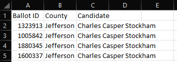
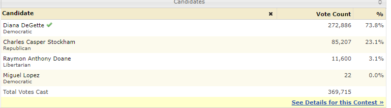
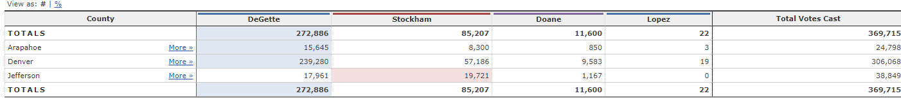

# Audit of Election Data and Proof-of-Concept for Automation

## Project Overview
This repository contains a Python-based tool for consuming individual voter data from an election, and running tabulations for that election.  

This tool has been developed at the behest of the Colorado Board of Elections, and was used to conduct an election audit of a recent congressional election. These audits are historically conducted in Microsoft Excel, but the employee has expressed the desire to automate this process in a scalable manner so that it can be used for other elections throughout the state. The trial run for this software was conducted using voting data from Colorado's 1st District.

The initial request was as follows:

1. Tabulate total number of votes cast
2. Identify complete list of candidates who received votes
3. Identify all counties where voting occurred
4. Calculate percentage of votes each candidate received
5. Calculate percentage of vote per county
6. Identify county with largest share of total vote
7. Identify winner of election based on popular vote

Additional work was conducted to do the following:

1. Segment each vote by county and candidate
2. Identify percentage of candidate vote per county

Finally, data verification checks were conducted to ensure that all counts on a county, candidate, and county+candidate level all match one another when aggregated.

All of the above calculations are then printed both to the terminal and to an output file (in this case, `election_results.txt`).  This data readout was then used for comparison against official results.  This audit identified discrepancies with the official tally, including missing and reallocated votes.

## Resources
* Data source: election_results.csv
* Software: Python 3.10, Visual Studio Code 1.62.3
* Reference: Stack Overflow, Colorado Secretary of State website (http://historicalelectiondata.coloradosos.gov)

## The Data

The data being audited in this project is a collection of individual votes from the 2018 US Congressional election in Colorado's 1st Congressional District, in which incumbent Diana DeGette [won another term in Congress](https://ballotpedia.org/Colorado%27s_1st_Congressional_District_election,_2018).

Data is comprised of a CSV containing a total of 369,711 records, with each record representing a single vote with the following data points:
* Voter ID
* County
* Candidate receiving vote

No personally identifiable information (PII) of individual voters is contained in the data.

## The analysis tool

Logical flow of the tool is as follows:
* import `csv` and `os` python modules
* identify locations of input and output files
* initialize lists and dicts for tracking
* iterate over every row, and:
    * increment vote tally by one
    * add new candidate name if not previously identified in data, and increment vote counter for the candidate
    * add new county name if not previously identified in data, and increment vote counter for the county
* Initialize strings for generating report sections
* Calculate percentages for each county and determine a winner.  Append results to report section.
* Calculate percentages for each candidate and determine a winner.  Append results to report.
* Calculate percent of candidate votes on a county-by-county basis and determine highest vote-getter in each county.  Append results to report.
* Conduct data verification

## Scalability Assessment

The intent of this audit was as a proof-of-concept to produce a tool that can be used throughout the Colorado Board of Elections.  As such, the tool was designed to be agnostic to the actual values of the data such as names of candidates and counties.

The ideal scenario for easy scalaibility is if the source file is a CSV, with the following specs (see supporting screenshot below):

* Three columns of data
    * Second column contains County name
    * Third column contains Candidate name
* First row contains header information



Operating under these assumptions, the only modifications required involve the input and output files, by altering this block of code beginning on line 10:
```
# import full voting data
votes_file = os.path.join("Resources", "election_results.csv")
output_path = os.path.join("analysis", "election_results.txt")
```
Should the data contain no header rows, comment out the following line of code on line 32:
```
    headers = next(file_reader)
```
If County is replaced by another data point requiring the same manner of analysis (for example, precinct), the code should be easily modifiable by simply conducting a find-and-replace exercise on the data and rename all instances of "County" with the relevant attribute.  Incorporating more dimensions for segmentation would require a refactor, ideally to support 3-tier or even *n*-tier data segmentation.

## Design Challenges and Considerations

Data structures are difficult to manipulate with standard Python libraries.  Better data manipulation techniques would have been available through the usage of tools like Pandas.

In this project, a major challenge was identifying the appropriate design of a two-tier data structure to facilitate county-by-county analysis.  Multiple variations of lists/dictionary combinations were used before settling on the following two-tier dictionary structure:

```
{
'Jefferson':    {'Charles Casper Stockham': 19723,
                'Diana DeGette': 17963, 
                'Raymon Anthony Doane': 1169}, 
'Denver':       {'Charles Casper Stockham': 57188,
                'Diana DeGette': 239282,
                'Raymon Anthony Doane': 9585},
'Arapahoe':     {'Charles Casper Stockham': 8302,
                'Diana DeGette': 15647, 
                'Raymon Anthony Doane': 852}
}
```

Original approach was the use of a four-tier list-dict-list-dict framework in order to leverage dictionary keys for column headers rather than actual data values, but this proved unwieldy and difficult to use for lookups and manipulation, and the column headers were ultimately not needed in this case.

## Audit Results

Total votes cast: 369,711

### Votes Per County
* Jefferson: 10.5% (38,855)
* Denver: 82.8% (306,055)
* Arapahoe: 6.7% (24,801)

Largest County Turnout: **Denver**

### Votes Per Candidate 
* Charles Casper Stockham: 23.0% (85,213)
* Diana DeGette: 73.8% (272,892)
* Raymon Anthony Doane: 3.1% (11,606)

### Election Winner
* WINNER: **Diana DeGette**
* Winning Vote Count: 272,892
* Winning Percentage: 73.8%

### County-level Results

#### Jefferson
* Candidate votes:
    * Charles Casper Stockham: 50.8% (19,723)
    * Diana DeGette: 46.2% (17,963)
    * Raymon Anthony Doane: 3.0% (1,169)
* Total votes in county: 38,855
* Candidate with most votes: Charles Casper Stockham

#### Denver
* Candidate votes:
    * Charles Casper Stockham: 18.7% (57,188)
    * Diana DeGette: 78.2% (239,282)
    * Raymon Anthony Doane: 3.1% (9,585)
* Total votes in county: 306,055
* Candidate with most votes: Diana DeGette

#### Arapahoe
* Candidate votes:
    * Charles Casper Stockham: 33.5% (8,302)
    * Diana DeGette: 63.1% (15,647)
    * Raymon Anthony Doane: 3.4% (852)
* Total votes in county: 24,801
* Candidate with most votes: Diana DeGette

## Analysis

### Election Results

Diana DeGette was the clear winner in the election, with an overwhelming **73.8%** of the total vote.  This was largely driven by her success in Denver; she received 78.18% of the vote in a jurisdiction that represented 82.8% in the total vote.

Charles Casper Stockham had a small edge over DeGette in Jefferson County.  Further analysis of the candidates and their respective counties is needed, but it is a safe assumption that this is due to the relative partisan affiliation of Jefferson compared to Denver and Arapahoe.

Raymon Anthony Doane received a small margin (~3% in every county) and was not competitive in this race, which is to be expected for a candidate running on a third party ticket.

Given the margin of DeGette's victory, it is safe to conclude that the outcome of the election is not in question, and no recounts should be required, but anomalies do exist within the data that bring the official tally into question and highlight the need for further investigation.

### Identified Data Discrepancies

Multiple anomalies exist in this data when compared to the [official results](https://historicalelectiondata.coloradosos.gov/eng/contests/search/year_from:2018/year_to:2018/office_id:10/division_id:16483/stage:et-id-7) from the office of Colorado's Secretary of State as displayed below:



First, the aggregate vote count in the audit data contains 369,711 votes as compared to the official count of 369,715, for an aggregate discrepancy of four total votes.  Identifying the cause is made more complicated by the breakdown of vote totals for each candidate, as they have all seen some level of change in their vote total:

| Candidate | Official Result | Audit Result | Difference |
|-----|------|------|-----|
| Diana DeGette | 272,886 | 272,892 | +6 |
| Charles Casper Stockham | 85,207 | 85,213 | +6 |
| Raymon Anthony Doane | 11,600 | 11,606 | +6 |
| Miguel Lopez | 22 | N/A | -22 |
| **Total** | **369,715** | **369,711** | **-4** |

Notably, a fourth candidate exists in the official tally: Democratic candidate Miguel Lopez, who received 22 votes.  This candidate's votes were not present in the final analysis.  Oddly, his votes seem to have been somewhat equally redistributed to the other candidates.

This even reallcoation occurs on the county-by-county level, with each major candidate receiving an additional two votes in each respective county ([Source](https://historicalelectiondata.coloradosos.gov/eng/contests/view/3924/)):



## Further analysis

Much of the capability of analysis for this data set in isolation has been exhausted, given the limited data points provided.

Further cause analysis is required to identify the reason for the 22 votes cast for Miguel Lopez.  The recommended next step is an analysis of the individual precinct data available at the Secretary of State's website ([here](https://historicalelectiondata.coloradosos.gov/eng/contests/download/3924/show_granularity_dt_id:7/.csv)). This may lead to identification of a specific precinct or precincts with voter irregularities.